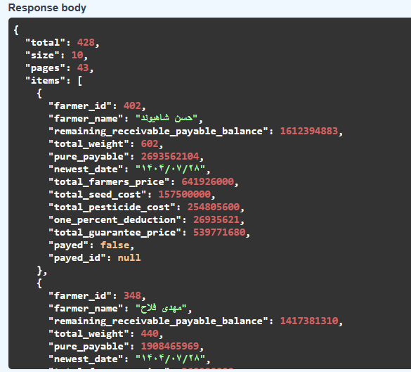

# گزارش مراحل پروژه درس برنامه‌نویسی وب

در این فایل، گزارشی از مراحل انجام پروژه به‌همراه توضیح هر بخش و تصاویر مربوط به هر مرحله ارائه شده است.  
هدف از این گزارش، مستندسازی فرآیند طراحی، پیاده‌سازی و تست سامانه به‌صورت گام‌به‌گام می‌باشد تا روند اجرای پروژه به‌صورت کامل قابل مشاهده و بررسی باشد.

## مرحله1:

در این مرحله، یکی از APIهای سمت سرور با استفاده از محیط Swagger مورد بررسی و تست قرار گرفت.  
ابتدا این API فراخوانی شد و ساختار ورودی‌ها (Query Parameters) و خروجی‌ها (Response) آن به‌صورت دقیق مشاهده و تحلیل گردید.
سپس اطلاعات این API شامل پارامترها، نوع داده‌ها، کاربرد هر فیلد، نحوه صفحه‌بندی (pagination) و نحوه مرتب‌سازی (sorting) در قالب جداول مستند‌سازی شد.  
هدف از این کار، درک دقیق رفتار API و آماده‌سازی آن برای استفاده در سمت فرانت‌اند و سایر بخش‌های سامانه بود.

### نمونه Response

## مرحله2:

در این مرحله، یکی از صفحات سمت کاربر (صفحه اصلی سامانه) مورد بررسی قرار گرفت و با استفاده از قسمت Network از Inspect مشخص شد که این صفحه چه APIهایی را از سمت سرور فراخوانی می‌کند.

با تحلیل درخواست‌های ارسالی از فرانت‌اند به بک‌اند، دو API که صفحه اصلی برای دریافت اطلاعات کاربر و گزارش‌های آماری از آن‌ها استفاده می‌کند شناسایی شدند.  
این کار باعث شد ارتباط بین رابط کاربری و سرویس‌های بک‌اند به‌صورت شفاف مشخص شود و مسیر تبادل داده‌ها در سیستم بهتر درک گردد.

## مرحله3:

- در این مرحله، صفحات سمت کاربر با استفاده از HTML، CSS و JavaScript طراحی و پیاده‌سازی شدند.  
- برای ایجاد ظاهر مدرن و واکنش‌گرا (Responsive) از فریم‌ورک Tailwind CSS استفاده شد تا صفحات در اندازه‌های مختلف صفحه‌نمایش (md و lg) به‌درستی نمایش داده شوند.  
- با استفاده از JavaScript و jQuery ارتباط بین صفحات و APIهای سمت سرور برقرار گردید.  
- در این بخش، داده‌ها از طریق درخواست‌های GET و POST از سرور دریافت و در جداول و بخش‌های مختلف رابط کاربری نمایش داده می‌شوند.  
- همچنین عملیات‌هایی مانند افزودن، حذف و به‌روزرسانی اطلاعات به‌صورت داینامیک و بدون نیاز به رفرش صفحه پیاده‌سازی شد.  
- در نهایت، مدیریت احراز هویت کاربران و ارسال توکن در هدر درخواست‌ها نیز به‌طور کامل اعمال گردید.

### نمونه ای از صفحات وب

### نمونه ای از صفحات وب بر روی موبایل

### نمونه ای از نحوه اتصال صفحات به APIها

## Table of contents

- [Overview](#overview)
  - [The challenge](#the-challenge)
  - [Screenshot](#screenshot) -
- [My process](#my-process)
  - [Built with](#built-with)
  - [Useful resources](#useful-resources)
- [Author](#author)

## Overview

### The challenge

Users should be able to:

- View the optimal layout for the section depending on their device's screen size

### Screenshot

### Links

- Live Site URL:[Responsive-social-proof-section-master](https://somaye-beiranvand.github.io/FrontendMentor-Responsive-social-proof-section-master/)

## My process

### Built with

- HTML5
- CSS custom properties
- Flexbox
- CSS Grid
- Mobile-first workflow
- bootstrap

### Useful resources

- [bootsrtap customizations](https://www.youtube.com/watch?v=nCX3QVl_PiI) - This helped me customize bootstrap containers max-width

## Author

- Frontend Mentor - [@somaye-beiranvand](https://www.frontendmentor.io/profile/yourusername)
